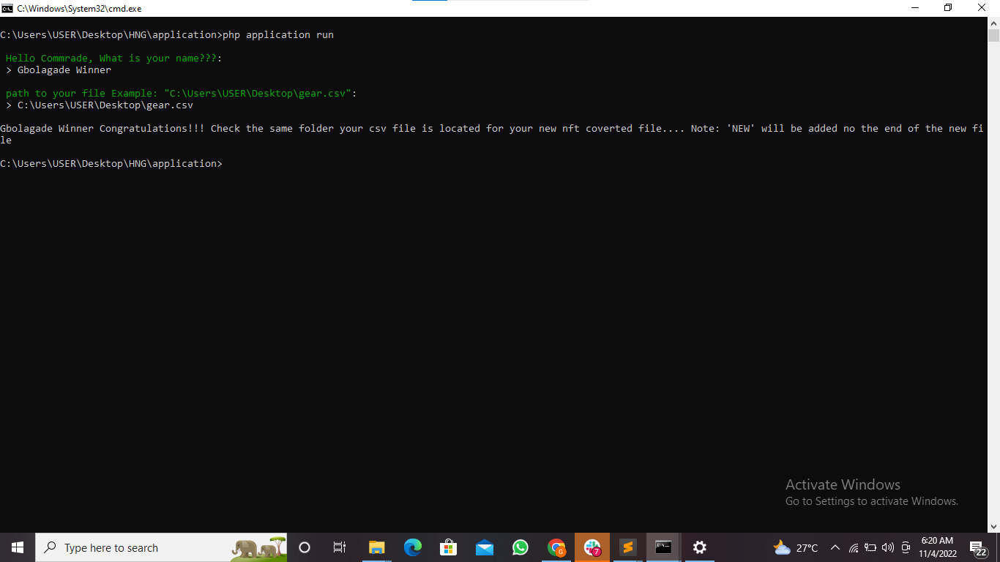

------

    

<h4> 
This is a <bold>community project</bold> and not an official Laravel one 
</h4>

What the cli tool does

1. Takes in a csv file
2. Convert the csv file to CHIP-0007 compatible json
3. hashed the CHIP-0007 compatible json
4. Convert the json to array
5. Append the hash to each column
7. Convert array to json and
8. Convert the json back to csv
------

## Documentation

How to use the cli tool

1. Clone the project
2. Navigate to the directory of the project you just cloned and run composer install
3. Run this command (php Application run)
    After running php Application run the cli tool is going to ask series of question from you....YIKES dont be nervous, its just 2 questions
    
    Question 1: Hey Commrade, Whats your name?? (You are expected to specify your name in this column)
    Question 2: Path to your file Example: (C:\Users\USER\Desktop\gear.csv) Note it is prefarable if you move the csv file you want to work with to desktop folder first, so you can just edit the name of my file and add yours, trust me writing file path can be crazy sometimes
    
    Then the new csv file will be create in the same folder as the old one(something like(gearName.csv). 

